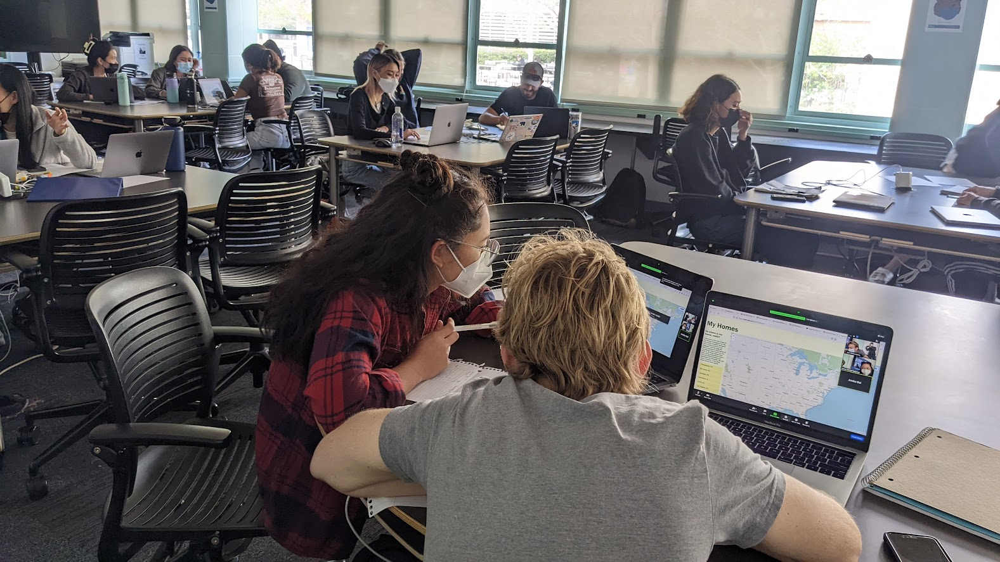

# ECO208 
##### Introduction to Econometrics B
#### 入門計量経済学B

Week 1 | September 23, 2022

# Welcome.
 
 
 
 
 
 

# Join the class!

#### Step 1

### Step 2

# Hello!

## Call me "Yoh"

## 

[My journey](https://yohman.github.io/21S-DH151/Weeks/Week01/misc/me.html)

##

##

##

# Your turn! | あなたの番

- your name | 名前
- your passion | 最近ハマってるもの
- your research interest | 研究するとすればこんなことやってみたい

## My teaching philosophy 私の教育哲学
### 1: class = community

### 2: it's a two way street

Source: LA Times

### 3: sharing is caring

[Source: CDTA Law](https://cdtalaw.com/cdta/the-importance-of-sharing-knowledge-in-any-legal-context/)

## You are here to learn "Econometrics" or...　計量経済学

# What is Econometrics? 計量経済学とは？

思い浮かぶものを[Jam Board](https://jamboard.google.com/d/1sxsy3z41gAqdQpiZ3pgwo4J-nm9xJ8QFxW9QwhrqFrw/edit?usp=sharing)に書いてね

### 
###### According to wikipedia...

# Say what?
# In other words... すなわち…

# You will use RStudio

#

# Schedule スケジュール

## 

Week | Topic 
--|--
Week 1 | オリエンテーション：計量経済学とは What is Econometrics? 
Week 2 | 単回帰分析 Simple regression analysis
Week 3 | R と RStudioの紹介 R and RStudio

###

Week | Topic
--|--
Week 4 | Rを用いた回帰分析 Simple regression analysis using R 
Week 5 | グループワーク① Group work ①
Week 6 | グループワーク② Group work ②

###

Week | Topic
--|--
Week 7 | 中間プレゼンテーション Midterm Presentations

###
Week | Topic
--|--
Week 8 | 重回帰分析① Multiple regressions ①
Week 9 | 重回帰分析① Multiple regressions ②
Week 10 | ロジスティック回帰分析① Logistic Regression ①
Week 11 | ロジスティック回帰分析② Logistic Regression ②

###
Week | Topic
--|--
Week 12 | グループワーク① Group work ①
Week 13 | グループワーク② Group work ②
Week 14 | グループワーク③ Group work ③

###
Week | Topic
--|--
Week 15 | ファイナルプレゼンテーション Final Presentation 

## Grading｜成績評価

- 出席（１５回） 50%
- 宿題 （5回）10% 
  - 回数は変わるかも
- プレゼン（２回） 40%

## 
出席 (1500 x 1/15 x 0.5)
 +
宿題 (500 x 1/5 x 0.1)
 +
プレゼン (200 x 1/2 x 0.4) 
 \=
 100

##
- 出席率60%以上で評価対象となります
(大学全体と同様)
- 宿題は期限までに出せば１００点

# Textbooks｜教科書

##

【タイトル】
入門計量経済学―Excelによる実証分析へのガイド

【著者】
山本 拓, 竹内 明香

【発行社】
新世社

【定価】
2,800円（＋税）

#
【タイトル】
[例題で学ぶ]
初歩からの計量経済学

【著者】
白砂堤津耶

【発行社】
日本評論社

【定価】
2,800円（＋税）

#
【タイトル】
計量経済学

【著者】
浅野晳・中村二朗

【発行社】
有斐閣

【ISBN】
978-4-641-1-6336-2

【定価】
3,300円（＋税）

# Assignment | 今週の宿題

Fill out [this survey](https://forms.gle/KRBccLbEZ1UPnYDN6)
この[サーベイ](https://forms.gle/KRBccLbEZ1UPnYDN6)を提出

日曜の夜11時59分まで