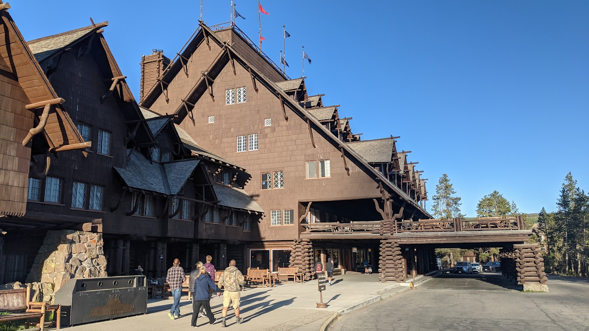

# ECO208 

#### R and RStudio

Week 4 | October 14, 2022

## <span style="color:green">How you doin'?</span>😎
<!-- <br> -->
<!-- <br> -->
<!-- <br> -->
<!-- <br> -->
<!-- <br> -->
<br>
<br>
<br>
<br>


# 先週の宿題

「英語ばかりで理解に時間がかかる。」
「正直何をやっているかさっぱりわからない…」

###

「今日初めてR Studio を使ってみて非常に難しい印象…」

「不安ですが新しいことに挑戦するのも好きなので頑張りたいと思います。」
###

「すごく楽に感じた。正直Excelよりも楽に感じた。」

「この講義で初めてRを使いましたが、思ったよりも簡単に出来そう」

###

「Pythonよりは少し扱いやすいのかな…」

「パイソンと同じで1文字でも間違えたらエラーが出てしまうので結構神経を使うものだ」

###

「これからたくさんのコマンド、コードを学び、少しはオリジナリティのあるコードを書いてみたい。」
「まだ氷山の一角にしか触れていない…」

###

「分かる人が分からない人に教えることでコミュニケーションを増やす、お互いが高めあうという時間を多く取り入れてクラス全員で高めあえたらなと思います。それでもわからない場合は先生に聞いて解決することで、最終的に社会に出て多くの分野で活躍できる人材になれるような授業にしてもらいたいです。」

###


# 今日もR三昧


## Let's get started

### Launch R Studio　（RStudioを使おう）

Open RStudio, go to File → New Project

<kbd></kbd>

### Create a new project


###


### Change "W3" to "W4"


###


###

Pause: Are we all here?

## Let's load some data! 🤓
先週と同様、gapminderデーターをロードしましょう。

- ```data```フォルダーを作る
- 先週のgapminderデーターを今週のデーターフォルダーにコピペする

## データー確認

ちゃんとデーターをアクセスできますか？

チェック：

```r
gapminder <- read.csv("data/gapminder_data.csv")
```

### View the data
```r
gapminder
```
```r
head(gapminder)
```
```r
str(gapminder)
```
```r
summary(gapminder)
```

## ggplot2


Say hi to ggplot2

https://ggplot2.tidyverse.org/


### ggplot2をインストール
```r
install.packages("tidyverse")
```
### Create an R script file<br>R Scriptファイルを作成


### RStudioパネル一覧


## １-Code Editorでスクリプトを書こう

コードのコピペは[こちらのサイト](https://github.com/yohman/ECO208/blob/main/Week4/W4.md)からできます

### プロットを作ろう

gapminderでプロットを作るコードを書いて run
```r
# import ggplot
library(ggplot2)

# create a scatter plot
ggplot(data = gapminder, aes(x = gdpPercap, 
                             y = lifeExp
                             )) +
  geom_point()

```
### スクリプトの分析


### さらに要素を足せる

Add color:
```r
# import ggplot
library(ggplot2)

# create a scatter plot
ggplot(data = gapminder, aes(x = gdpPercap, 
                             y = lifeExp, 
                             color=continent
                             )) +
  geom_point()

```

### x軸をログスケールにする
```r
# import ggplot
library(ggplot2)

# create a scatter plot
ggplot(data = gapminder, aes(x = gdpPercap, 
                             y = lifeExp, 
                             color=continent,
)) +
  geom_point()  + scale_x_log10()

```

### ポイントを半透明にする
```r
# import ggplot
library(ggplot2)

# create a scatter plot
ggplot(data = gapminder, aes(x = gdpPercap, 
                             y = lifeExp, 
                             color=continent,
)) +
  geom_point(alpha = 0.5)  + scale_x_log10()

```

### 他にも色々できますよ！

## R Scriptのメリットはなんですか？

###
- ファイルとしてセーブできる
- コンソールと違ってまとめたコードが書ける
- レポート形式に上から下へ課題を順番通りに述べることができる


## Scatter plots in R

とりあえず、R console パネルに戻りましょう（左下）

### 実はRにはサンプルデーターがいっぱい含まれてる。

```R
data()
```

<small>デモデーターの説明は[こちら](https://www.trifields.jp/r-sample-data-491)</small>


### 例えば、```women```のデーターを調べよう。

このデータセットは30-39歳のアメリカ人の女性の平均の身長と体重を与えます。

```r
str(women)
```

```r
head(women)
```

```r
summary(women)
```

### Plot the data

まずはデーターを```attach()```しましょう。

```r
attach(women)
```
<span style="font-size:0.6em">```attach```関数を使うと、データフレームを指定しなくても、
そのデータフレームに含まれる変数にアクセスすることができます。</span>

### plot women


```r
plot(height,weight)
```
<span style="font-size:0.6em">散布図の```x,y```の順番です</span>

### Clean the plot

```r
plot(height,
     weight,
     main="US women's height",
     xlab = "Height (cm)", 
     ylab="Weight (pounds)")

```
<span style="font-size:0.6em">タイトル```main```、軸のレーベル```xlab,ylab```</span>

### 散布図に近似直線(回帰直線)を付ける

```r
abline(lm(weight~height), col="red")
```
<span style="font-size:0.6em">lm(y~x)：yは目的変数、xは説明変数</span>


### Try it with a different dataset

同じことを今度は```cars```でやってみよう。

### Old Faithful (Yellowstone)

```faithful```とは？


##


##


##
　
時間がたったら…
ドッガーン！！
🌋


### それはともかく

```faithful``` のデーターを調べよう

- 行はいくつある？ How many data points?
- 変数の数は？ How many variables/columns?
- 各変数の平均と中央値は？What are the means and medians for each column?
- 散布図を見せて？Can you create a scatter plot?
- 散布図に近似直線(回帰直線)を付けられる？Can you add a regression line to the plot?


