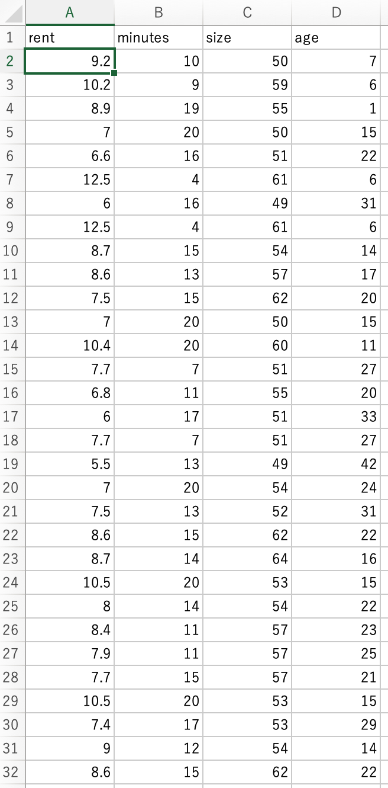

# ECO208 
##### 回帰分析
#### Regression Analysis

Week 2 | September 30, 2022

# What's up?😎
 

## What is regression analysis? 

回帰分析とは、求めたい要素の値に対し、他の要素がどの程度影響を与えているかを分析する手法です。

# Say what? 😕

## Examples
じゃ〜色んな例を考えてみよう

### 
| independent variable 説明変数|| dependent variable 目的変数|
|---|---|---|
|Pokemon's caught 捕まえたポケモン数| ➡️ |Distance walked 歩いた距離|

###
#### プラスかマイナス？

### 

| independent variable 説明変数|| dependent variable 目的変数|
|---|---|---|
|Advertising 広告費| ➡️ | revenue 利益|

###
#### プラスかマイナス？

###

| independent variable 説明変数|| dependent variable 目的変数|
|---|---|---|
|walking minutes to station 駅まで徒歩何分| ➡️ |rent 家賃|

<small style="font-size:0.6em">[source: ie agent](https://ieagent.jp/blog/chie/ekitoho20fun-201877)</small>
###
#### プラスかマイナス？

###

| independent variable 説明変数|| dependent variable 目的変数|
|---|---|---|
|hours spent partying| ➡️ |grades|

###
#### プラスかマイナス？

###

| independent variable 説明変数|| dependent variable 目的変数|
|---|---|---|
|hours practiced 練習量| ➡️ |points per game 得点力|

###
#### プラスかマイナス？

###

| independent variable 説明変数|| dependent variable 目的変数|
|---|---|---|
|student height 身長| ➡️ |grades 成績|

###
#### プラスかマイナス？

## Types of regressions

- simple 単回帰分析
- multiple 重回帰分析
- logistic ロジスティック回帰分析

## Let's try it in Excel

## Data

## Data in Excel

## 何が知りたい？

目的変数と説明変数を決める

## 

| independent variable 説明変数|| dependent variable 目的変数|
|---|---|---|
|minutes 駅まで徒歩何分| ➡️ ||
|size 面積| ➡️ |rent 家賃|
|age 築年数| ➡️ ||

##

おっと、これだと**重**回帰分析だ！
## 

まずは**単**回帰分析をやろう

##

| independent variable 説明変数|| dependent variable 目的変数|
|---|---|---|
|minutes 駅まで徒歩何分| ➡️ |rent 家賃|

## 仮設検定

### 帰無仮説 【null hypothesis】
$$H_0 = 駅までの徒歩分数は家賃に全く影響がない$$

$$coefficient 回帰係数　\beta_1 = 0$$

### 対立仮説【alternative hypothesis】
$$H_1 = 駅までの徒歩分数は家賃に影響がある$$
$$\beta_1 \neq 0$$

## では、データをダウンロードしよう

## 
First, a scatter plot
まずは散布図を作ろう

##
近似曲線

##
式を出す

## ではEXCELで単回帰分析をやろう

## Regression options

## データで見ると？

## Regression output

## なんだこりゃ？

## まずは回帰式を作ろう

$$Y = a + bX$$

$$家賃（万円）＝　a + b * 駅まで徒歩分数$$

##

##

家賃（万円）＝　10.09 - 0.125 x 駅まで徒歩分数

## すなわち

南柏の駅からの徒歩分数が1分増えるごとに
家賃が1250円減る

## では「a」（切片）は何？

これは「x」がゼロの時の数値。

すなわち、駅から徒歩分数がゼロの賃貸（ありえますか？）の場合、家賃は１０.０９万円

## Is this trustworthy?

How good are the 説明変数's?

Is there a "real" relationship? 

Or just a "lucky" outcome based on chance?

## How good is this model?
#### R2, t-statistic, p-value

## R-Squared: How well does it fit?

R2 = 1 (perfect fit 😀)
R2 = 0 (bad fit　😖)

## ではこの分析のR2乗は？

##

「目的変数である家賃は値変動を説明変数である徒歩分数は１１.５９％しか説明できていない。」

## What about the P value?

P値で説明変数（徒歩分数）が目的変数（家賃）に対して関係があるかどうかを確認する

##

P値が優位水準0.05未満であれば、
「説明変数が目的変数に有意に影響している」と判断ができる。

要するに、この関係性はランダムではないので、帰無仮説 【null hypothesis】をrejectすることができる。

## でも…

## うわ！６.０９％！
微妙〜
<h1>😑</h1>

##
微妙でもオッケーの判断はあなた次第。

有意水準を上げてもいい。
## 要するに：
「p値の有意水準を０.１だと、説明変数（徒歩分数）が目的変数（家賃）に対して有意に影響していることが言える。」

At 94% level of confidence that relationship is not due to random chance. That relationship actually exists in the housing market.

## それでは、宿題として...

他の説明変数で試してみよう！

## Size, Age　どちらでもいいので、同じ単回帰分析をやる

## レポート形式で提出

- Google docを使う
- タイトル
- あなたの名前
- イントロ（何がやりたいのかを説明する）
##
- 仮設検定を行う（帰無仮説は？対立仮説は？）
- 散布図を入れる（近似曲線を忘れないでね）
- Excelの単回帰分析のアウトプットを入れる
- 回帰式を入れて、説明する
- R2を説明する（説明変数は目的変数を何%説明しているか）
- 説明変数が目的変数に有意に影響しているかどうかを文章で書いて、p値で表す