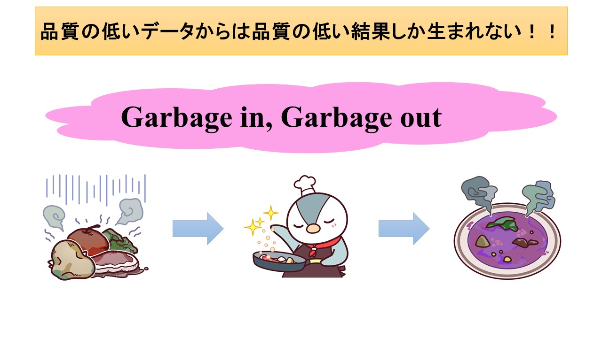

# ECO208 

#### Group Presentation Preparations

Week 6 | November 4, 2022

## <span style="color:white">How you doin'?</span>😎
<!-- <br> -->
<!-- <br> -->
<!-- <br> -->
<!-- <br> -->
<!-- <br> -->
<br>
<br>
<br>
<br>
<br>
<br>
<br>
<br>
<br>


## 今日はグループ活動🤩
でもその前に回帰分析

Let's review


# Rで回帰分析

【参考】Rを用いた回帰分析（PDF)


##

<span style="font-size:0.8em">

```r
# データーを取得
chiba <- read.csv("data/chiba rent.csv")

# attach する
attach(chiba)

# 散布図
plot(minutes,rent)

# 散布図に近似直線(回帰直線)を付ける
abline(lm(rent~minutes), col="red")

# 回帰分析を実行
lm(rent~minutes)

# 変数に入れる
result = lm(rent~minutes)

# 回帰分析のsummary結果
summary(result)

```

</span>

### summary output


##


## 今後の予定

<span style="font-size:0.8em">

| Week | Date | Topic |
| ---- | ---- | ----|
| Week 5 | 10/21 | グループ決め・テーマ決め |
| Week 6 | 今日 | プロポーザルを発表<br>グループワーク |
| Week 7 | 11/11 | グループワーク<br>プレゼンの準備 |
| Week 8 | 11/18 | 中間プレゼン1日目 |
| Week 9 | 11/25 | 中間プレゼン2日目<br>（必要であれば）|

</span>


## 中間プレゼンについて

<span style="font-size:0.8em">

- テーマ：Rを用いて回帰分析を行い、プレゼンをする
- 分析テーマは自由（これが吉😆と出るか凶😫と出るか…）
- 回帰分析の結果(Rの出力結果)は個人ごとに全員提出すること
(グループ全員同じ結果で構いませんが,推定作業は個人ごとに行ってみること.)


## グループ紹介

<span style="font-size:0.8em">

不動明王
たけのこの里派
No Name
Run Away
F4
ジムクラブ
終わった人
３年２組
GEAR6
左の人

# Word of advice...

"Garbage in, garbage out"

「ゴミを入れれば、ゴミが出てくる」

# すなわち



[image source](https://datasciencemore.com/ml-common-sense/)

## では、it's group time!

今週の課題：
- データを探す
- グループで検証する 
- プロジェクトに使えるか・相応しいかを先生と判断する
- ダウンロードする
- Rに使えるように準備する
- Rにデータを読み込む

